<div align="center">


# Ambience

**Ambience** — a curated set of VS Code color themes, from cinematic
dark & light palettes to a warm amber terminal aesthetic.
Each theme is a complete design system: editor, syntax, semantic tokens,
UI chrome, and integrated terminal.

[](https://marketplace.visualstudio.com/items?itemName=AxelOllivier.ambience-themes)
[](https://marketplace.visualstudio.com/items?itemName=AxelOllivier.ambience-themes)
[](https://open-vsx.org/extension/AxelOllivier/ambience-themes)
[](LICENSE)

</div>

---

## Install

From VS Code: open **Quick Open** (`Ctrl/Cmd+P`) and run

```
ext install AxelOllivier.ambience-themes
```

Or grab it from the [VS Code Marketplace](https://marketplace.visualstudio.com/items?itemName=AxelOllivier.ambience-themes)
or [Open VSX](https://open-vsx.org/extension/AxelOllivier/ambience-themes).

Then pick one with **`Ctrl/Cmd+K Ctrl/Cmd+T`** → *Ambience: …*

---

## Themes

### Dark

**Amber** — warm amber · author's desktop OS
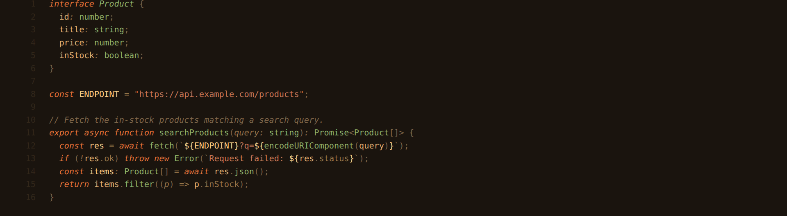

**Blade Runner** — *Blade Runner 2049* · Villeneuve, 2017
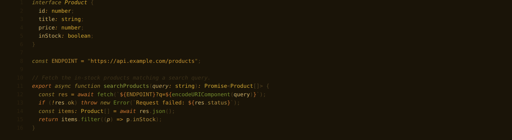

**Dune** — Villeneuve, 2021
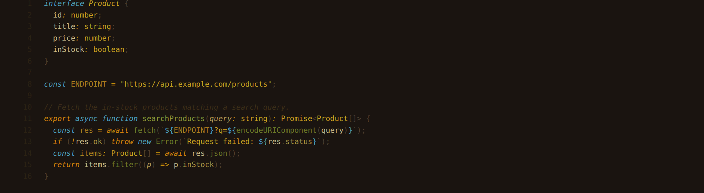

**Ghost in the Shell** — Oshii, 1995
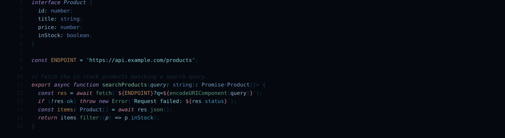

**Princess Mononoke** — Miyazaki, 1997
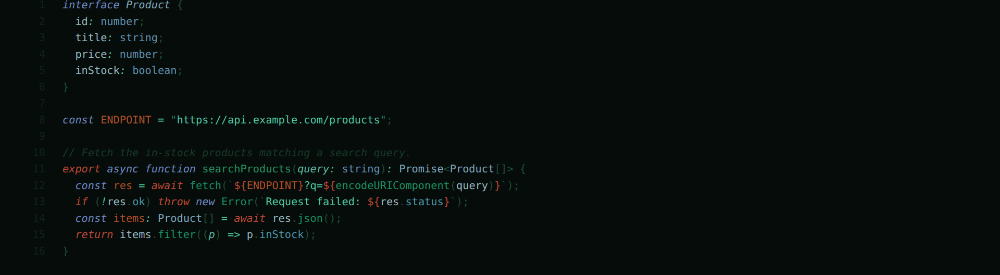

**The Empire Strikes Back** — *Star Wars* · Kershner, 1980
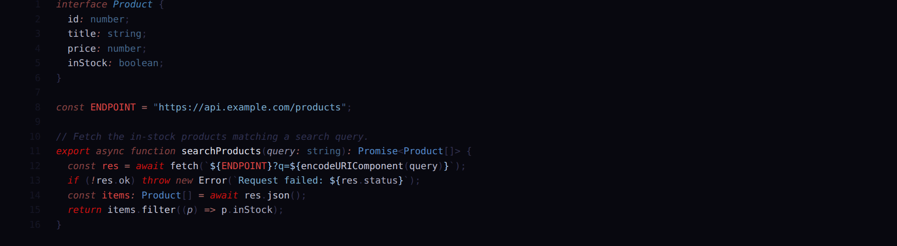

**OLED** — pure-black, OLED-optimised
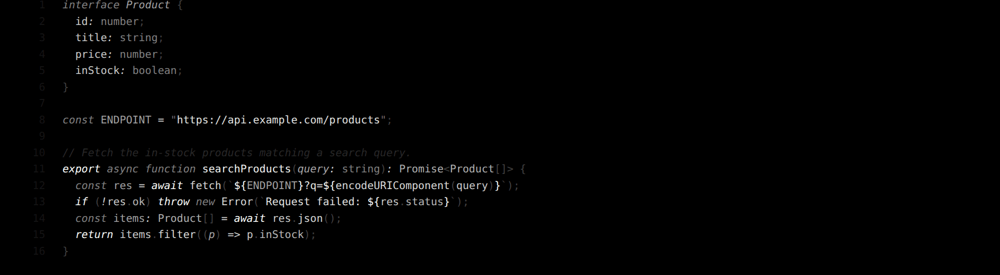

**Cowboy Bebop** — Watanabe, 1998
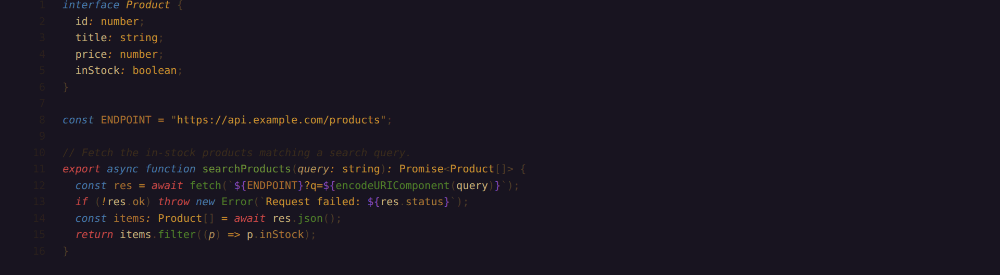

**Annihilation** — Garland, 2018
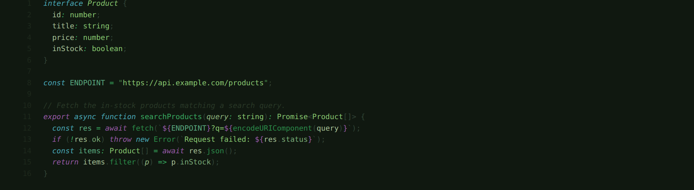

**Arrival** — Villeneuve, 2016
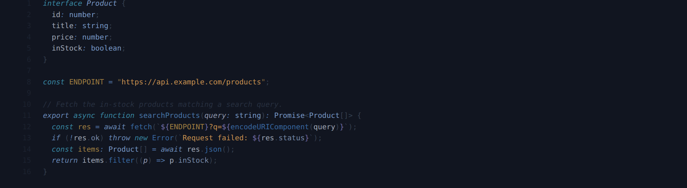

### Light

**Ghost in the Shell — Day** — the light counterpart
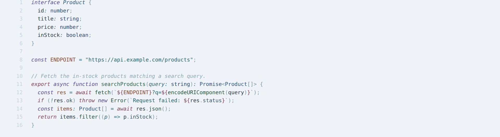

**Her** — Jonze, 2013
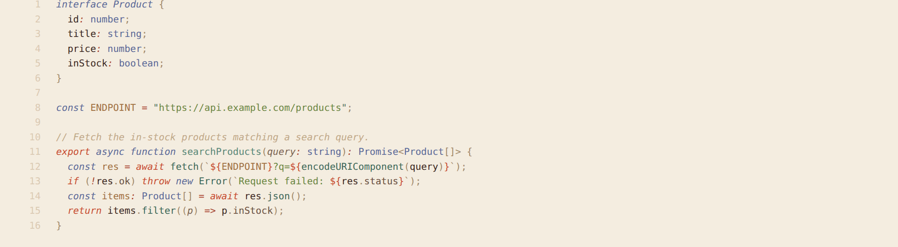

**Paper** — calm ink-on-paper
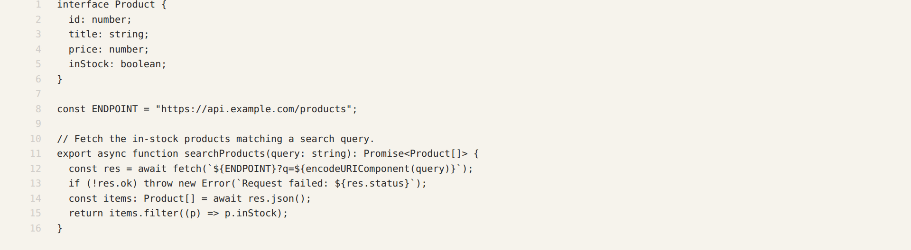

---

## Features

- **13 complete themes** — dark and light, each tuned end to end.
- **Semantic highlighting** — colours follow your language server, not just TextMate scopes.
- **Integrated terminal** — every theme styles the 16 ANSI colours, not only the editor.
- **Considered chrome** — activity bar, tabs, lists, git decorations, diffs, brackets and minimap all themed.
- **Tuned editor defaults** — some themes ship a matching font & cursor (e.g. Amber → *JetBrainsMono Nerd Font*, Ghost in the Shell → *IBM Plex Mono*). Override them anytime by setting your own `editor.fontFamily` in settings.

---

## License

Released under the **[GNU GPL v3.0](LICENSE)**. See [`NOTICE`](NOTICE) for the
copyright scope and redistribution obligations. Referenced film/anime titles are
trademarks of their respective owners; their use in theme labels is editorial and
implies no affiliation or endorsement.

<div align="center"><sub>Made by Axel Ollivier · <a href="https://github.com/Axel-Ollivier/ambience">github.com/Axel-Ollivier/ambience</a></sub></div>
